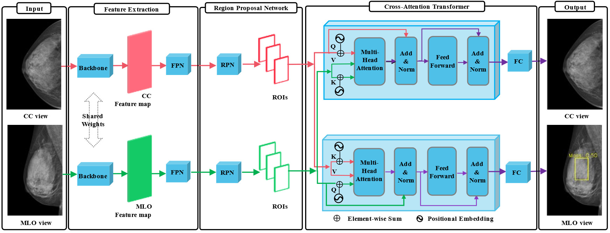
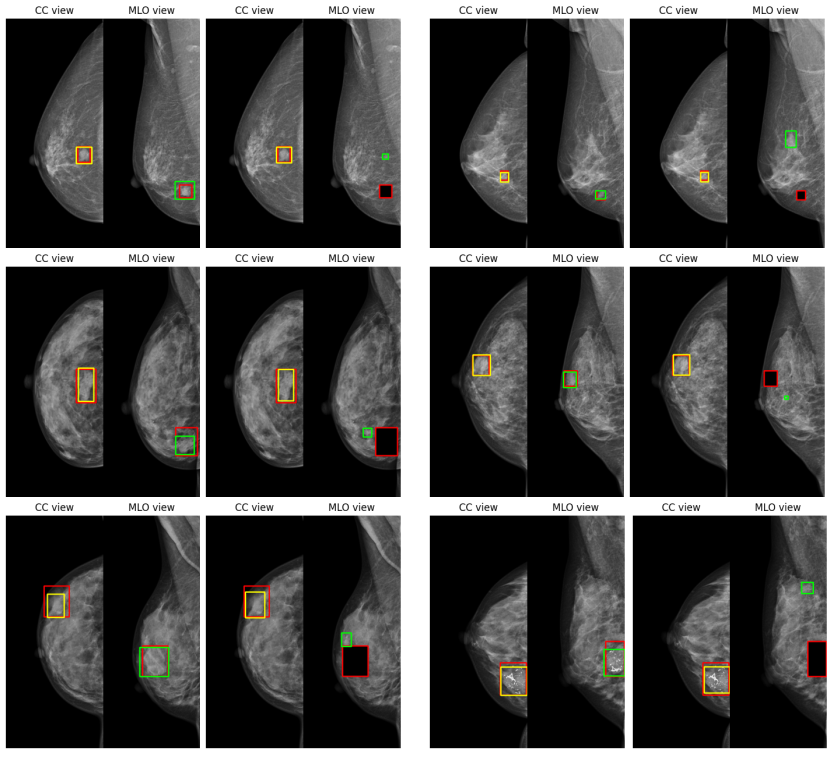

# TransReg: Cross-transformer as auto-registration module for multi-view mammogram mass detection

This repository contains the code and experiments for the paper: 
> [TransReg: Cross-transformer as auto-registration module for multi-view mammogram mass detection ](https://arxiv.org/abs/2311.05192)

## Overview

* We introduce TransReg, a novel multi-view detector using cross-transformers for ipsilateral views on mammograms. To the best of our knowledge, our work is the first time cross-transformers have been incorporated into an object detection framework for modeling the intricate relationships between CC and MLO views. Our proposed TransReg outperforms all baseline and state-of-the-art methods on DDSM and VinDrMammo datasets in Free-Response Operating Characteristic (FROC) mass detection. When employing SwinT as the feature extractor network, our dualview approach surpasses even tri-view state-of-the-art models.\
* We conduct extensive experiments to demonstrate that TransReg, using cross-transformer, have the ability to register masses in CC and MLO views and effectively utilize the cross-view information to generate diagnostic predictions automatically. These experiments thereby thoroughly analyze the capacity of our model to replicate the natural diagnostic workflow followed by expert radiologists, which serves as a reliable testament to the practical utility and the alignment of a CAD system to clinical practices
## Model architecture:


*TransReg architecture: The dual-views are encoded by shared weight Faster RCNN network to extract the region of interest (RoIs). The bidirectional cross-transformer network then leverages the cross-view information between RoIs from dual-views before making the final prediction. Positional encoding is added to the RoIs representation to include the spatial information*

## Auto-registration ability


*Vizualization of the highest relevance score box in MLO view corresponding to the prediction box in CC view for image from VinDr-Mammo dataset and masked synthesis dataset. Column 1 and 3 refer to the views from original datasets and column 2 and 4 refer to the corresponding views in synthesis datasets. The red boxes are ground truth annotation, the yellow boxes are the prediction boxes of the model on the CC view, and green boxes are the proposals on MLO view have the highest relevance score*

## Data preparation

* DDSM dataset: The dataset can be downloaded at [http://www.eng.usf.edu/cvprg/mammography/database.html](http://www.eng.usf.edu/cvprg/mammography/database.html). We preprocess the DDSM dataset following the setting described in the paper [CBIS-DDSM](https://www.nature.com/articles/sdata2017177) using this repo [https://github.com/fjeg/ddsm_tools](https://github.com/fjeg/ddsm_tools). We modifyied the code to preprocess all the images instead of only abnomality images. 

* VinDr-Mammo dataset: The dataset can be downloaded at [https://www.physionet.org/content/vindr-mammo/1.0.0/](https://www.physionet.org/content/vindr-mammo/1.0.0/)

## Dependencies
```
Pytorch 1.13.1
Python 3.7 
```
## Training and evaluation
### Training
```
# Singview SwinT
python train.py --data-dir your-data-directory --data data_configs/ddsm2.yaml -b 4 -j 16 --epochs 41 --eval-frequent 2 -opt adam --lr 1e-5 --model fasterrcnn_swint_fpn_sigmoid --imgsz 1000 1500 --loss mix  --name your-output-directory

# Singview Resnet50
python train.py --data-dir your-data-directory --data data_configs/ddsm2.yaml -b 4 -j 16 --epochs 41 --eval-frequent 2 -opt adam --lr 1e-5 --model fasterrcnn_resnet50_fpn_sigmoid --imgsz 1000 1500 --loss mix  --name your-output-directory

# Multiview SwinT
python train_multi.py --data data_configs/vindr_mamo_2.yaml --data-dir your-data-directory -b 4  -j 16 -opt adam --lr 1e-5  --eval-frequent 2 --epochs 41 --model multiview_detector_swint   --imgsz 500 1200 --loss mix  --name your-output-directory

# Multiview Resnet50
python train_multi.py --data data_configs/vindr_mamo_2.yaml --data-dir your-data-directory -b 4  -j 16 -opt adam --lr 1e-5  --eval-frequent 2 --epochs 41 --model multiview_detector   --imgsz 500 1200 --loss mix  --name your-output-directory

```
### Evaluation

```
# Singview SwinT
python eval.py --data-dir your-data-directory --data data_configs/ddsm2.yaml  -b 1 -w 16  --imgsz 1000 1500 -m fasterrcnn_swint_fpn_sigmoid -mw model-weight

# Singview Resnet50
python eval.py --data-dir your-data-directory --data data_configs/ddsm2.yaml  -b 1 -w 16  --imgsz 1000 1500 -m fasterrcnn_resnet50_fpn_sigmoid -mw model-weight

# Multiview SwinT
python eval_multi.py --data data_configs/vindr_mamo_2.yaml --data-dir your-data-directory -b 1  -w 16 --imgsz 500 1200 -m multiview_detector_swint -mw model-weight

# Multiview Resnet50
python eval_multi.py --data data_configs/vindr_mamo_2.yaml --data-dir your-data-directory -b 1  -w 16 --imgsz 500 1200 -m multiview_detector -mw model-weight

```
## Acknowledgement
The code is based on (https://github.com/sovit-123/fasterrcnn-pytorch-training-pipeline)[https://github.com/sovit-123/fasterrcnn-pytorch-training-pipeline]


